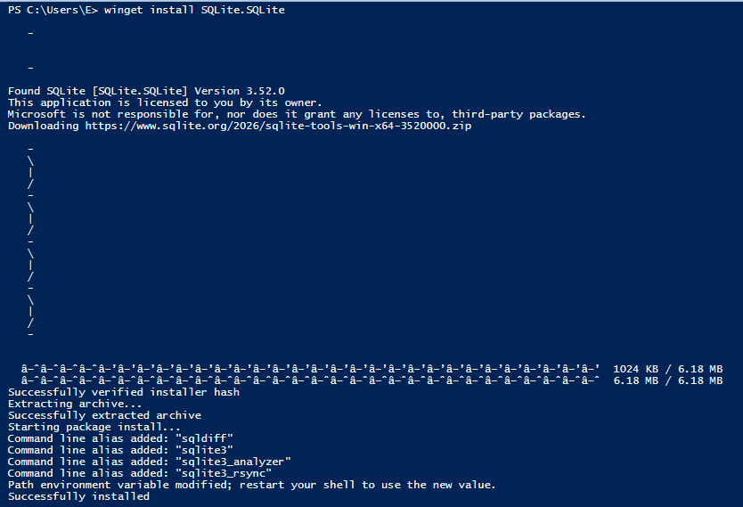
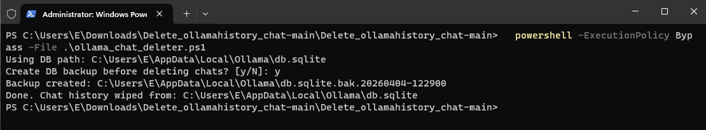
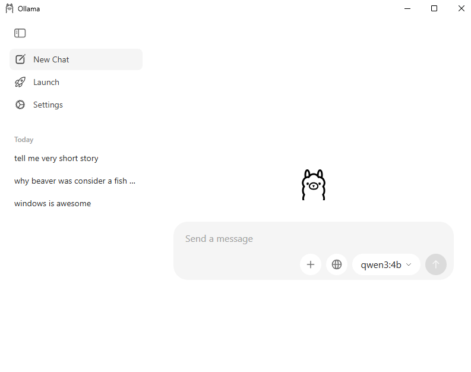
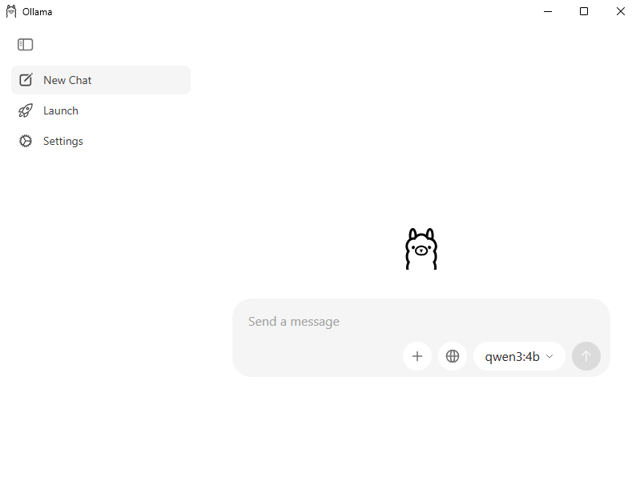

# Ollama chat history cleaner

I made these scripts to clean only the chat history and the logs from Ollama GUI and server.
It does not remove models, users, or app settings.

Motivation: order and privacy. But is not only me, [Reddit post](https://www.reddit.com/r/ollama/comments/1dbi1el/how_to_clear_or_disable_user_chat_history/), [PR](https://github.com/ollama/ollama/pull/14326), [issue](https://github.com/ollama/ollama/issues/3002), [issue](https://github.com/ollama/ollama/issues/13926), [issue](https://github.com/ollama/ollama/issues/11785), [issue](https://github.com/ollama/ollama/issues/15099), [issue](https://github.com/ollama/ollama/issues/14313), [and another](https://github.com/ollama/ollama/issues/14908)

Scripts are available for **macOS**, **Linux**, and **Windows**.

On macOS and Windows it checks common Ollama database paths automatically.
It also checks if `sqlite3` is installed and if the needed tables exist.

When you run it, it asks if you want a backup.
Default answer is **No**.

## Before and after

Before running the script:


After running the script:


---

## macOS and Linux

### Install sqlite3

**macOS:**
```bash
brew install sqlite
```

**Debian / Ubuntu:**
```bash
sudo apt update && sudo apt install -y sqlite3
```

**Fedora:**
```bash
sudo dnf install -y sqlite
```

**Arch:**
```bash
sudo pacman -S sqlite
```

### How to run

```bash
chmod +x ./ollama_chat_deleter.sh
./ollama_chat_deleter.sh
```

If your DB is in another place, pass it like this:

```bash
OLLAMA_DB="/full/path/to/db.sqlite" ./ollama_chat_deleter.sh
```

If you do not want the backup question, you can force it:

```bash
OLLAMA_BACKUP=no ./ollama_chat_deleter.sh
```

or:

```bash
OLLAMA_BACKUP=yes ./ollama_chat_deleter.sh
```

### Delete Ollama logs

```bash
chmod +x ./ollama_logs_deleter.sh
./ollama_logs_deleter.sh
```

By default it uses:

```bash
$HOME/.ollama/logs
```

Before deleting, it prints all files/directories that will be removed and asks:

```text
Delete all items above? [y/N]:
```

Only `y` or `yes` will continue. Any other answer cancels the delete.

If your logs path is different, use:

```bash
OLLAMA_LOG_DIR="/full/path/to/logs" ./ollama_logs_deleter.sh
```

---

## Windows

### Install sqlite3

**Option 1 — winget (recommended):**

Open PowerShell and run:

```powershell
winget install SQLite.SQLite
```

> **Tip:** If winget fails with a certificate error (0x8A15005E), run these two commands first:
>
> ```powershell
> winget settings --enable BypassCertificatePinningForMicrosoftStore
> winget upgrade Microsoft.AppInstaller --accept-source-agreements --accept-package-agreements
> ```
>
> Then retry `winget install SQLite.SQLite`.



After install, winget places `sqlite3.exe` inside `%LOCALAPPDATA%\Microsoft\WinGet\Packages\` but does **not** add it to your PATH automatically. Fix it:

1. Find the exact path:

```powershell
Get-ChildItem "$env:LOCALAPPDATA\Microsoft\WinGet\Packages" -Recurse -Filter "sqlite3.exe" | Select-Object FullName
```

2. Add the folder to your user PATH (replace the path with what the command above returned):

```powershell
[Environment]::SetEnvironmentVariable("Path", $env:Path + ";C:\Users\<YOU>\AppData\Local\Microsoft\WinGet\Packages\SQLite.SQLite_Microsoft.Winget.Source_8wekyb3d8bbwe", [EnvironmentVariableTarget]::User)
```

3. Close and reopen PowerShell, then verify:

```powershell
sqlite3 --version
```

**Option 2 — manual:**

1. Go to https://sqlite.org/download.html
2. Under *Precompiled Binaries for Windows*, download `sqlite-tools-win-x64-*.zip`
3. Extract `sqlite3.exe` to a folder like `C:\tools\sqlite3\`
4. Add that folder to your PATH:
   - Open **Start** → search *Environment Variables*
   - Edit *Path* under *User variables*
   - Add the folder path and click OK
5. Reopen PowerShell and verify: `sqlite3 --version`

### Allow PowerShell scripts to run

Windows blocks unsigned scripts by default. Run this once to allow local scripts:

```powershell
Set-ExecutionPolicy -Scope CurrentUser RemoteSigned
```

Or, to bypass for a single run without changing policy:

```powershell
powershell -ExecutionPolicy Bypass -File .\ollama_chat_deleter.ps1
```

### How to run

```powershell
.\ollama_chat_deleter.ps1
```



> **Note:** The script stops Ollama before wiping the database and waits for all
> Ollama processes (including the tray app) to exit before proceeding. If the
> `-wal` or `-shm` sidecar files cannot be removed because another process still
> holds them, a warning is printed but the chat deletion has already succeeded —
> SQLite cleans those files automatically on the next open.

The script looks for the database in these locations and uses the first one it finds:

- `%APPDATA%\Ollama\db.sqlite`
- `%LOCALAPPDATA%\Ollama\db.sqlite`

If your DB is somewhere else:

```powershell
$env:OLLAMA_DB = "C:\full\path\to\db.sqlite"
.\ollama_chat_deleter.ps1
```

To skip the backup prompt:

```powershell
$env:OLLAMA_BACKUP = "no"
.\ollama_chat_deleter.ps1
```

or:

```powershell
$env:OLLAMA_BACKUP = "yes"
.\ollama_chat_deleter.ps1
```

Before running the script:



After running the script:



### Delete Ollama logs (Windows)

```powershell
.\ollama_logs_deleter.ps1
```

By default it uses:

```text
%USERPROFILE%\.ollama\logs
```

If your logs path is different:

```powershell
$env:OLLAMA_LOG_DIR = "C:\custom\log\path"
.\ollama_logs_deleter.ps1
```

> [!NOTE]
>  Right now these are more involved that I would like to, but I do not have the knowledge to make this into multiplatform app

//
Enjoy
