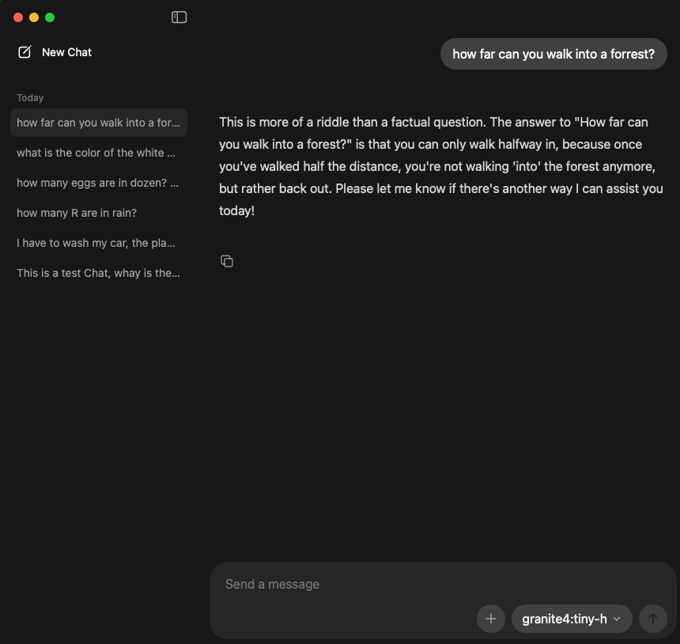
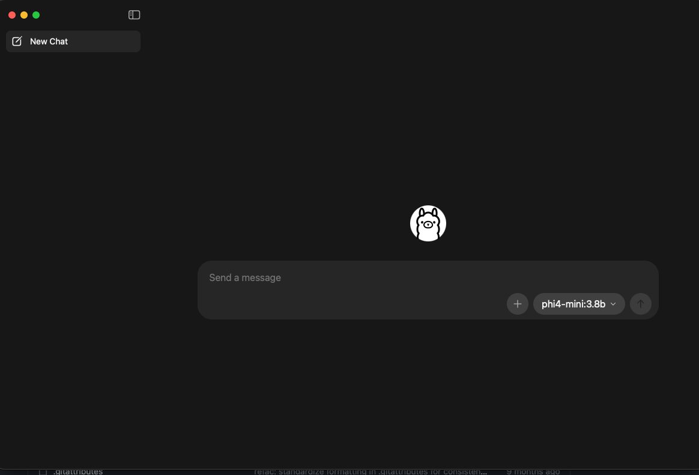

# Ollama chat history cleaner

I made this script to clean only the chat history from Ollama GUI.
It does not remove models, users, or app settings.

The script works on macOS and Linux.
On macOS it checks common Ollama database paths.
It also checks if `sqlite3` is installed and if the needed tables exist.

When you run it, it asks if you want a backup.
Default answer is **No**.

## Before and after

Before running the script:



After running the script:



## How to run

```bash
chmod +x ./ollama_chat_deleter.sh
./ollama_chat_deleter.sh
```

If your DB is in another place, pass it like this:

```bash
OLLAMA_DB="/full/path/to/db.sqlite" ./ollama_chat_deleter.sh
```

If you do not want the backup question, you can force it:

```bash
OLLAMA_BACKUP=no ./ollama_chat_deleter.sh
```

or:

```bash
OLLAMA_BACKUP=yes ./ollama_chat_deleter.sh
```
